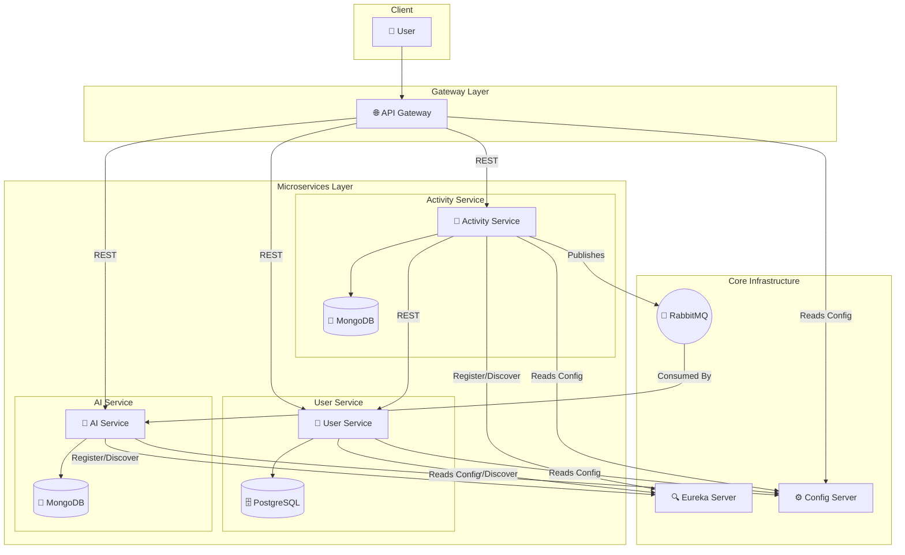

# Intro

Implementing Microservice pattern in Spring Boot along with
- Service Discovery (Eureka)
- API Gateway
- Config Server
- Gemini AI integration

## Setup
- First run `eureka` so all services can be registered and discovered.
- Second run `configserver` so all configs are available
- run all remaining service one after one
- Also run dependency for each service like Mongo, Postgres, RabbitMQ. (refer HLD for dependency of DB)
- Now just test APIs

For running RabbitMQ
```
docker run -it --rm --name rabbitmq -p 5672:5672 -p 15672:15672 rabbitmq:4-management
```
For running KeyCloak
```
docker run -p 127.0.0.1:8181:8080 -e KC_BOOTSTRAP_ADMIN_USERNAME=admin -e KC_BOOTSTRAP_ADMIN_PASSWORD=admin quay.io/keycloak/keycloak:26.4.0 start-dev
```

## Local URL to inspect running

- Eureka : http://localhost:8761
- RabbitMQ : http://localhost:15672
- KeyCloak : http://localhost:8181
- Gateway : http://localhost:8080

## High level diagram



Consideration

- keycloak id is treated as primary as userId in whole app