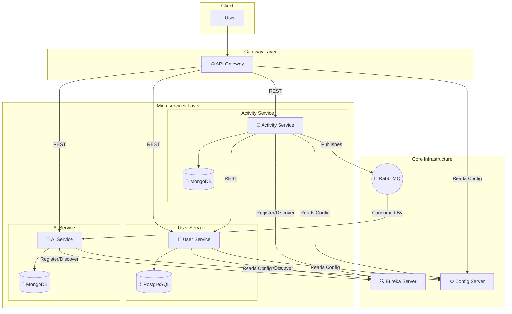

For RabbitMQ


```
docker run -it --rm --name rabbitmq -p 5672:5672 -p 15672:15672 rabbitmq:4-management
```


## High level diagram


```mermaid
graph TD
    %% ==== CLIENT LAYER ====
    subgraph Client
        A[👤 User]
    end

    %% ==== API LAYER ====
    subgraph Gateway["Gateway Layer"]
        B[🌐 API Gateway]
    end

    %% ==== SERVICE DISCOVERY & CONFIG ====
    subgraph Core["Core Infrastructure"]
        C[🔍 Eureka Server]
        D[⚙️ Config Server]
        H((📨 RabbitMQ))
    end

    %% ==== SERVICES LAYER ====
    subgraph Services["Microservices Layer"]
        subgraph UserSvc["User Service"]
            E[🧩 User Service]
            I[(🗄️ PostgreSQL)]
        end

        subgraph ActivitySvc["Activity Service"]
            F[🏃 Activity Service]
            J[(🍃 MongoDB)]
        end

        subgraph AISvc["AI Service"]
            G[🤖 AI Service]
            K[(🍃 MongoDB)]
        end
    end

    %% ==== CONNECTIONS ====
    %% Client to Gateway
    A --> B

    %% Gateway to Services
    B -- REST --> E
    B -- REST --> F
    B -- REST --> G

    %% Services register with Eureka
    E -- Register/Discover --> C
    F -- Register/Discover --> C
    G -- Register/Discover --> C

    %% Services read config from Config Server
    E -- Reads Config --> D
    F -- Reads Config --> D
    G -- Reads Config --> D
    B -- Reads Config --> D

    %% Async communication via RabbitMQ
    F -- Publishes --> H
    H -- Consumed By --> G

    %% Direct service-to-service communication
    F -- REST --> E

    %% Database connections
    E --> I
    F --> J
    G --> K
```